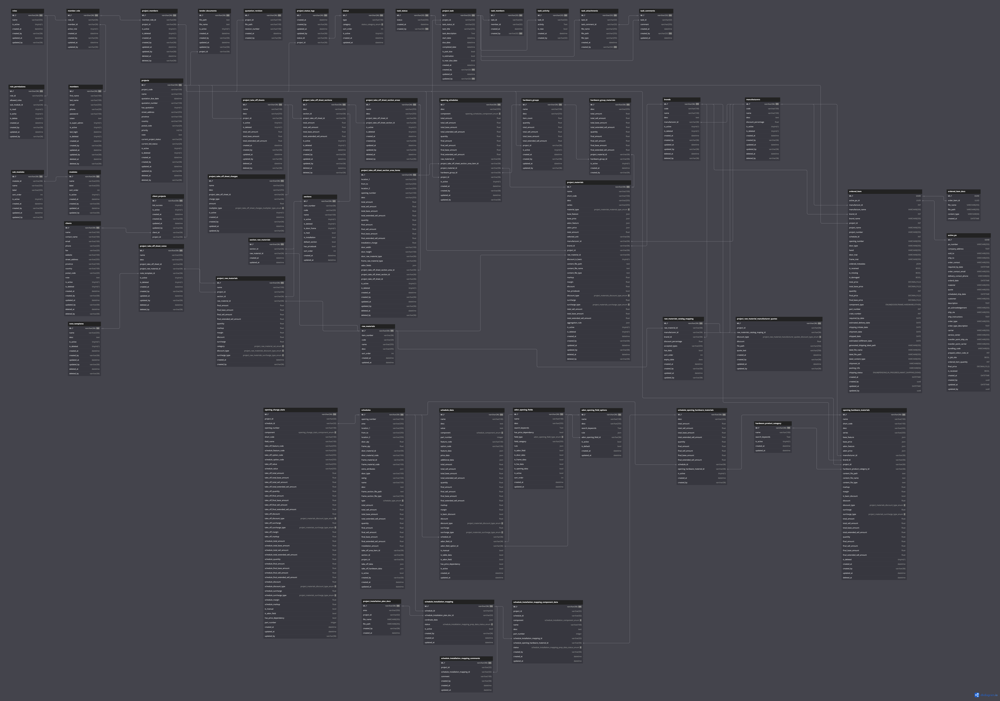

# **Diamond  Application Backend:**

## 1. Basic Setup:
- The [setupREADME.md](./setup/setupREADME.md) file contains the initial setup steps that needs to followed.

## 2.  Directory Structure:


```
diamond-backend/
│
├── app/
│ ├── controller/
│ |── middleware/
│ |── models/
│ |── router/
│ |── schemas/
│ |── utils/
│ └── .env.example
│ └── main.py
│ └── app.log
│
├── docs/
│ ├── pull_request_template.md
│
├── setup/
│ └── setup.sh
│ └── setupREADME.md
│
└── README.md
```
- The [app](./app/) Directory contains all files and directories relevamt to the application code
  - The [controller](./app/controller) Directory containes all the controller files which will be responsible for logical operations.
  - The [middleware](./app/middleware/) Directory containes all the middleware files which will be responsible for all task that will be triggeres before the requests reaches the controller that is the core logical part.
  - The [models](./app/models/) Directory containes all the models files which will be consisting of the Databse tables and its association among themselves.
  - The [router](./app/router/) Directory containes all the router files which will be responsible for routing all requests.
  - The [utils](./app/utils/) Directory containes all the utils files which will be responsible for some commin utility logics/operations.

- The [docs](./docs/) Directory containes all the documents which will be relevant to the application.
- The [setup](./setup/) Directory containes all the setup reated files which will contains all prerequisite to run the application.

## 3. Data Model:

   
   - [click Here](https://dbdiagram.io/d/Diamond_12th_Dec_2024-675975ef46c15ed479087095) to see the inderactive data model

## 4. Database Migration Steps:
  
   - [ALEMBIC](./docs/ALEMBIC.docx)
